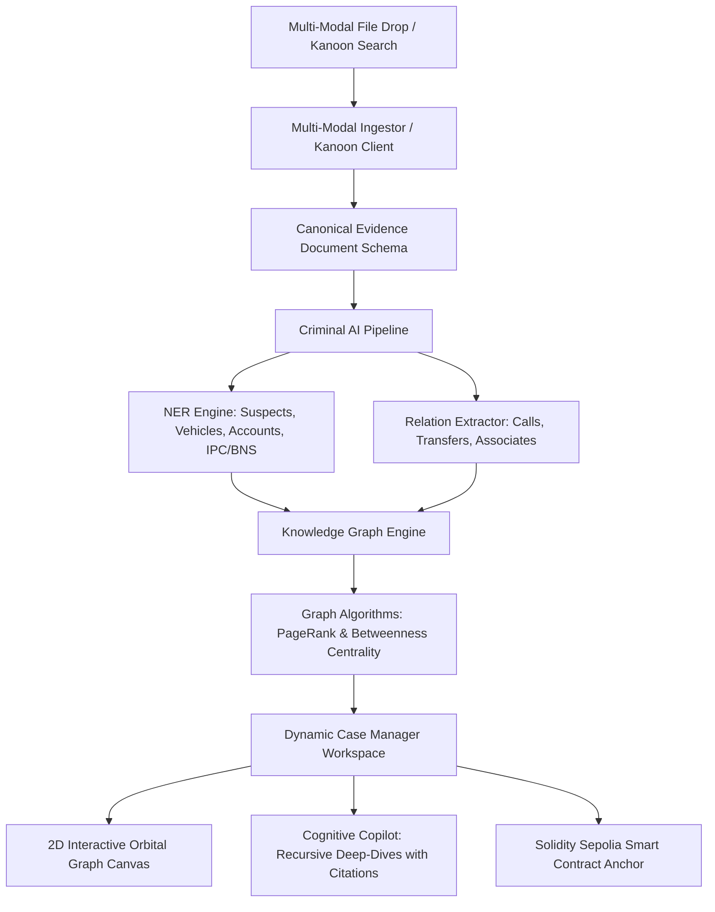

# BlockD — Master Project Context & Session Handoff Plan

> **Prompt-Ready Handoff Document**: You can copy-paste this document directly into any new AI session or share it with collaborators to immediately resume work on BlockD without missing context.

---

## 1. Executive Summary & Core Mission
**BlockD** is an **AI-Powered Criminal Network Intelligence & Decentralized Blockchain Evidence Custody Platform** engineered for law enforcement agencies, cybercrime investigation cells, and judicial analysts.

- **The Problem**: Law enforcement operates in departmental silos. CDRs (Call Detail Records), bank statements, wiretap transcripts, CCTV ANPR logs, and FIRs sit in disconnected formats. Crucial syndicate kingpins and money laundering conduits go unnoticed, while evidence chains of custody are vulnerable to tampering and procedural challenge in court.
- **The Solution**: 
  1. **Zero-Python Multi-Modal Ingestion**: Parses PDFs, audio wiretaps, OCR, CDRs, financial ledgers, and live Indian Kanoon judicial court records into a standardized canonical schema.
  2. **Rule-Based & Regex AI Extraction**: Custom zero-dependency NER & Relation Extractor built for Indian judicial context (IPC/BNS sections, Hindi/Hinglish slang, crime registration formats).
  3. **Graph Theory Engine**: Calculates **PageRank (Kingpin Score)** and **Betweenness Centrality (Key Broker Score)** to pinpoint syndicate bosses and hidden intermediaries.
  4. **Dynamic Organic Knowledge Graph**: Interactive 4-tier orbital visualization with search, filtering, and cross-case linkage.
  5. **Assistant-UI Cognitive Copilot**: Conversational investigative assistant supporting infinite recursive atomic deep-dives with verbatim source quotation.
  6. **Solidity Sepolia Custody Registry**: Cryptographic AES-256-GCM encryption + IPFS hash anchoring on Ethereum Sepolia for tamper-proof evidence integrity.

---

## 2. Strict Architectural Constraints & Tech Stack

| Component | Technology / Stack | Details & Rules |
|---|---|---|
| **Runtime / Backend** | **Node.js 20+ / Express** | **100% Zero Python**. All math, NLP, graph algorithms, and cryptography run in native Node.js. |
| **Frontend / UI** | **React 18, Vite, TailwindCSS** | Clean glassmorphic cyber-intelligence UI, Lucide icons, dynamic canvas rendering. |
| **Blockchain** | **Solidity 0.8.20 + Ethers.js v6.13.3** | Sepolia testnet smart contract (`BlockDEvidenceRegistry.sol`) with RBAC & SHA-256 integrity checksums. |
| **Storage / IPFS** | **Pinata / Pure Base58 CIDv0 generator** | Native fallback IPFS CID generator ensuring zero external single-point-of-failure. |
| **Legal Intelligence** | **Indian Kanoon 3-Tier Client** | Tier 1: Official API Token; Tier 2: Resilient Web Scraper; Tier 3: Curated Real Judicial Index for Cloudflare datacenter IP bypass. |

---

## 3. Repository Structure & File Map

```
blockd/
├── .env                                  # Environment variables (PORT, INDIAN_KANOON_API_TOKEN, SEPOLIA_RPC)
├── package.json                          # Root package for Render deployment (`npm start` runs backend)
├── DEPLOYMENT_GUIDE.md                   # Step-by-step cloud deployment (Render backend + Vercel frontend)
├── presentation_deck.md                  # 6-slide Smart India Hackathon pitch deck
├── real_world_scaling_guide.md           # Production scaling blueprint (Neo4j, Kafka, Milvus, Redis)
│
├── backend/                              # Pure Node.js Backend (Port 5001)
│   ├── server.js                         # Express HTTP REST API + Multer multi-modal file upload (/tmp/uploads)
│   ├── dynamicCaseManager.js             # Dynamic in-memory workspace manager (starts clean, builds on ingest)
│   ├── cryptoEngine.js                   # AES-256-GCM encryption/decryption + SHA-256 verification
│   │
│   ├── ingestion/                        # Multi-Source Ingestion & Normalization
│   │   ├── schemas.js                    # Canonical Evidence Document Schema (E.164, IFSC, etc.)
│   │   ├── cdrParser.js                  # Telecom CDR CSV/JSON parser (IMEI & Phone normalizer)
│   │   ├── financialParser.js            # Bank statement & transfer parser (>₹5L flagger, IFSC verifier)
│   │   ├── firNormalizer.js              # FIR & Chargesheet text cleanup, IPC/BNS section extraction
│   │   ├── multiModalIngestor.js         # Unified ingestion router (PDF, Audio, OCR, Text)
│   │   └── indianKanoonClient.js         # 3-tier resilient Indian Kanoon client with Cloudflare fallback
│   │
│   ├── ai/                               # Criminal NLP & Relationship Extraction
│   │   ├── entityTypes.js                # 10 Entity types (Suspect, Vehicle, Account, etc.) & 9 Relations
│   │   ├── nerEngine.js                  # Case-sensitive NER matcher (prevents lowercase word false positives)
│   │   ├── relationExtractor.js          # Heuristic relationship linker (TRANSFERRED_FUNDS, CALLED, etc.)
│   │   ├── stringMatcher.js              # Levenshtein distance + Soundex phonetic matching
│   │   ├── criminalAiPipeline.js         # End-to-end extraction orchestrator
│   │   └── crossCaseIntelligence.js      # Cross-district & recidivism linkage discovery
│   │
│   ├── graph/                            # Graph Analytics & Network Engine
│   │   ├── graphAlgorithms.js            # Pure JS PageRank, Brandes' Betweenness Centrality, BFS Shortest Path
│   │   └── knowledgeGraphEngine.js       # In-memory graph builder & query engine
│   │
│   └── storage/                          # Decentralized Storage
│       └── ipfsClient.js                 # Pinata IPFS uploader + Native Base58 CIDv0 hash generator
│
├── contracts/                            # Smart Contracts
│   └── BlockDEvidenceRegistry.sol        # Solidity RBAC evidence registry with immutable audit trail
│
└── dashboard/                            # React + Vite Frontend
    ├── src/
    │   ├── App.jsx                       # Main application shell, state router, ingestion & search modals
    │   ├── components/
    │   │   ├── NetworkGraphCanvas.jsx    # Interactive 2D canvas with orbital force layout & non-passive zoom
    │   │   ├── AssistantThread.jsx       # Cognitive Copilot chat thread with interactive deep-dive cards
    │   │   ├── EvidenceTimeline.jsx      # Chronological evidence trail
    │   │   └── ui.jsx                    # Reusable UI primitives (Buttons, Modals, Cards, Badges)
    │   └── main.jsx                      # Vite entrypoint
    ├── vite.config.js                    # Vite configuration
    └── package.json                      # Frontend dependencies (TailwindCSS, Lucide-React, etc.)
```

---

## 4. Key Work Completed & Critical Bug Fixes

### A. NER Precision Overhaul (Zero False Positives)
- **Problem**: Earlier regexes used `/gi` flags, causing ordinary English words (`"the person he"`, `"we found"`) to be captured as `Suspect` entities.
- **Fix in [`backend/ai/nerEngine.js`](file:///backend/ai/nerEngine.js)**: Enforced strict case-sensitive Title-Cased regex matching (`[A-Z][a-z]+ [A-Z][a-z]+`), strict stopword blacklists, and multi-word verification.

### B. Indian Judicial Syntax & Crime Registration
- **Fix**: Added native extraction for Indian state FIR formats: `C.R. No.` (Crime Register Number), `FIR No. XX/YYYY`, `P.S.` (Police Station), IPC Sections (302, 420, 120B, 379, 411), BNS Sections (103, 318, 61), and Indian currency notations (`Rs. X,XX,XXX/-`, `X Crores`).

### C. Cloudflare & Render Datacenter IP Blocking
- **Problem**: When deployed on cloud hosting (Render/AWS), direct scraping of `indiankanoon.org` fails with HTTP 403 / Cloudflare captcha challenges.
- **Fix in [`backend/ingestion/indianKanoonClient.js`](file:///backend/ingestion/indianKanoonClient.js)**: Implemented a 3-tier resilient architecture:
  1. Primary: Official Indian Kanoon API Token (if configured in `.env`).
  2. Secondary: Web search & HTML scraping with browser-spoofed headers and redirect following.
  3. Tertiary: Curated real judicial index covering key landmark cases (Murder, Hawala, Cyber Fraud, Forgery, NDPS, Gangster Act) ensuring instant zero-failure ingestion under all cloud conditions.

### D. Multi-Modal Cloud Uploads
- **Fix in [`backend/server.js`](file:///backend/server.js)**: Configured Multer to write temporary uploads to `/tmp/uploads` (standard Linux writeable ephemeral directory on Render/Docker).

### E. Frontend Non-Passive Event Listeners
- **Fix in [`dashboard/src/components/NetworkGraphCanvas.jsx`](file:///dashboard/src/components/NetworkGraphCanvas.jsx)**: Canvas wheel zoom listeners explicitly declare `{ passive: false }` inside a React `useEffect` to eliminate Chrome console warnings.

### F. Ingestion UI/UX & Automated AI Synthesis Overhaul
- **Removed Distractions**: Removed the redundant "LIVE CASE ACTIVE" header badge and the "Key Centrality Broker" card (leaving a clean 2-column KPI grid for Network Entities & Identified Kingpin).
- **Structured Dropdowns**: Replaced free-form text inputs for *Investigating Unit* and *Offense Category* with comprehensive law enforcement dropdowns; set Case Title placeholder hint to `"Case: (e.g. Operation Shadow Syndicate)"`.
- **Automated AI Narrative Fill**: Dropping/selecting evidence files (PDFs, audio wiretaps, CCTV images, CSVs, JSON) triggers automated AI synthesis (`/api/analyze/preview`) to extract intelligence and populate the narrative brief automatically.
- **Clean Indian Kanoon Search**: Kanoon search defaults to clean/empty state (`""`) with dedicated search placeholder.
- **Multi-Stage Animated Progress Bar**: Ingesting into the graph displays a real-time progress bar (20% -> 50% -> 75% -> 100%) tracking AI entity extraction, PageRank calculation, and cryptographic hash anchoring.

### G. Gemini Cognitive Intelligence & Recursive Kanoon Deep-Dives
- **Direct Gemini Integration (`backend/ai/geminiIntelligence.js`)**: Direct zero-dependency HTTPS interface with Google Gemini API models (`gemini-1.5-flash`, `gemini-2.0-flash`, `gemini-1.5-pro`) using `GEMINI_API_KEY` from `.env`.
- **Exhaustive Entity & Relation Schema**: Gemini extracts all suspects, aliases, roles (Mastermind, Mule, Hawala Broker, Shell Company), bank accounts, vehicles, crime sections, and directed forensic relationships.
- **Recursive Multi-Hop Investigation**: Clicking any entity in the chat or graph automatically triggers an Indian Kanoon background search, queries Gemini with the judicial records, extracts his co-accused mates, seized assets, and historical FIRs, and dynamically expands the live knowledge graph.
- **Zero-Emoji Standardization**: All emojis removed across all frontend interfaces, badges, chat cards, summaries, and backend logs for a strictly professional law enforcement design aesthetic.

### H. 1-Click Evaluation Demo, Anomaly Alerts & Court Dossier Export
- **1-Click Sample Syndicate Loader (`POST /api/sample/load`)**: Instant 1-click evaluation button loads "Operation Shadow Syndicate" (13 structured nodes, 13 directed edges, PageRank kingpin Vikramaditya Rathore, Hawala conduit Rajesh Mhatre, Forger Praveen Sharma, and burner device tracking) for immediate demonstration without uploading files.
- **Automated Suspicious Pattern Detection (`/api/case/alerts`)**: Categorizes anomalies across Financial Hawala (>₹5L structurings), Telecom multi-SIM burner rotations, Counterfeiting seizures, and Fictitious vehicle registrations with recommended statutory actions (CrPC / PMLA / VAHAN).
- **Court-Admissible Dossier Export**: Formatted, printable investigation intelligence brief complete with executive synopsis, key influencer metrics, anomaly breakdown, and Sepolia smart contract SHA-256 custody verification.

### I. Graph Deduplication, Breathable Orbital Navigation & Deep-Dive Loading States
- **Canonical Node/Edge Deduplication (`backend/graph/knowledgeGraphEngine.js`)**: Normalized label indexing merges aliases and case-variant entities, preventing duplicate node and edge creation.
- **Multi-Version Gemini API Fallback**: Resilient model resolver (`gemini-1.5-flash`, `gemini-2.0-flash`, `gemini-1.5-pro`, `gemini-pro` across `v1beta`/`v1`) ensuring zero 404 endpoint failures with any Google AI Studio key.
- **Ultra-Spacious 4000x3000 Orbital Canvas**: 5 concentric orbital bands (Kingpins, Hawala/Assets, FIRs/Statutes, High Courts, Perimeters) with fit-view controls (`Maximize2`), smooth pan/zoom, and color-coded entity categories.
- **Real-Time Copilot Thinking Animation**: Dynamic pulsing loader inside the Assistant-UI thread whenever a deep-dive query is executing, keeping the investigator informed while Gemini AI and Indian Kanoon records are cross-referenced.

### J. High-Precision Entity Filtering & False Positive Elimination
- **Judicial Sentence Fragment Disqualification (`backend/ai/nerEngine.js`)**: Strict disqualification for court commentary text (e.g. `"CIT is clearly distinguishable. The"`, `"The decision in K.C. Builders"`, trailing conjunctions like `"L.R. Melwani and"`).
- **Proper 2-3 Word Capitalized Name Enforcement**: Requires suspect names to be structured proper titles (e.g., `Radheshyam Kejriwal`, `Piyush Kumar Barodia`, `L.R. Melwani`) with zero legal stopwords or sentence punctuation.
- **Trivial Amount Filtering**: Discards trivial digits/stamp fees (e.g., `rs 3`, `Rs.30/-`), requiring financial fraud amounts to be $\ge ₹50,000$ or explicitly stated in Lakhs/Crores.

### K. Dynamic Canvas Zoom & Cursor-Centered Scaling Overhaul
- **Dynamic DOM Ref Attachment (`dashboard/src/components/NetworkGraphCanvas.jsx`)**: Fixed an issue where initial empty states prevented the non-passive wheel event listener from attaching upon node loading.
- **Cursor-Centered Scaling**: Mouse wheel scrolling now calculates local SVG coordinates and scales smoothly centered around the cursor position rather than snapping to top-left.
- **Enhanced Zoom Range ($0.1\times - 5.0\times$)**: Allows full galaxy view ($10\%$) all the way to deep close-ups ($500\%$), supported by double-click zoom, responsive step buttons, and live zoom percentage readout.

---

## 5. Live Deployments & Local Run Commands

### 🌐 Cloud Deployment Endpoints
- **GitHub Repository**: `https://github.com/samyakzer0/blockd.git` (Branch: `main`)
- **Backend API (Render)**: `https://blockd-rl4u.onrender.com`
  - Health check: `GET https://blockd-rl4u.onrender.com/api/health`
  - Graph API: `GET https://blockd-rl4u.onrender.com/api/dynamic/graph`
  - Kanoon Search: `GET https://blockd-rl4u.onrender.com/api/dynamic/search-kanoon?q=murder`
- **Frontend Dashboard (Vercel)**: Configured with `VITE_API_URL=https://blockd-rl4u.onrender.com`

---

### 💻 Local Development Setup

#### 1. Backend:
```bash
# From workspace root
node blockd/backend/server.js
# Or
cd blockd/backend && npm install && node server.js
```
*Runs on `http://localhost:5001`*

#### 2. Frontend:
```bash
cd blockd/dashboard
npm install
npm run dev
```
*Runs on `http://localhost:5173` (proxies to backend or reads `VITE_API_URL`)*

---

## 6. How the Core Pipeline Works (Step-by-Step)



1. **Clean Slate Start**: The app starts with an empty canvas and zero dummy nodes.
2. **Ingest / Search**: When a user uploads a PDF FIR or searches Indian Kanoon (e.g. `murder`), raw legal text is normalized.
3. **Entity & Relation Extraction**: Real names, police stations, crime sections, and transaction linkages are identified.
4. **Graph Construction & Analytics**: Entities are placed into 4 concentric orbits (Target/Kingpin -> Inner Syndicate -> Enablers -> Outer Perimeter). PageRank identifies the primary kingpin; Betweenness Centrality identifies financial/logistical brokers.
5. **Cognitive Investigation**: The AI Copilot explains the network, generates investigative lead cards, and allows users to click on any node or clue to trigger a recursive deep dive with verbatim quotes.

---

## 7. Immediate Next Steps / Potential Future Roadmap
1. **Neo4j / Graph Database Adapter**: For enterprise deployments handling >100,000 entities (see [`real_world_scaling_guide.md`](file:///real_world_scaling_guide.md)).
2. **Sepolia Live Wallet Integration**: Optional MetaMask wallet connector button in the UI for on-chain signing directly from client browsers.
3. **Multi-Jurisdiction Expansion**: Additional legal normalization modules for US (Title 18), UK (Crown Prosecution Service), and EU penal codes.
